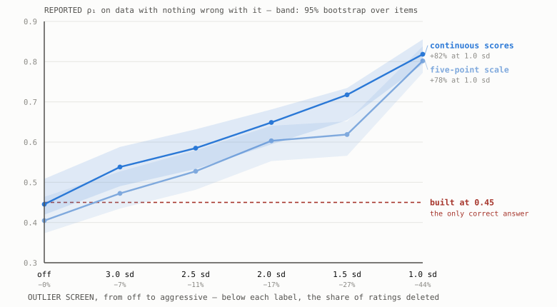

# Auditing the yardstick a judge leaderboard is scored against

A judge leaderboard scores a model against human votes and treats those votes
as ground truth. This repository asks what is known about the votes, and what a
quality gate does to the answer before anyone sees it.

Five results below, ordered by how hard they are to argue with; the first two
are on real, published third-party data. Every number in them is regenerated
and diffed on each push, behind **109 tests** that were each confirmed by
breaking the code until they failed. No credentials, no private data, no
third-party packages, and the whole chain finishes in seconds.

## 1. One documented parameter moves a published result by 38%

**All 39 published scores in [arXiv:2608.19936](https://arxiv.org/abs/2608.19936)
recompute exactly from its released data. Then moving one threshold the paper
states — panel agreement from three-of-four to unanimous — drops the mean score
38% and replaces two of its top six.**

The spans that panel could not agree on are 17% of the item set and carry a rate
**4.7x** the unanimous ones. Nineteen of 35 models change rank.

Not a correction: three-of-four is a reasonable choice, stated plainly upstream,
and the data cannot say whether a split panel marks the most diagnostic spans or
the least trustworthy ones. The point is that the sensitivity is not published.
[The analysis](METHOD.md#the-same-question-on-someone-elses-panel) ·
`python consensus_panel.py`

## 2. On that same real panel, an agreement screen removes the reference-setters first

Read the same released data as rating rows — item is a flagged span, rater is
one of the 39 models, score is 1 if it reproduced the reference — and a single
model's verdict carries `rho_1 = 0.3633`. Eight models are needed to reach
`rho_k = 0.80`.

Switch on the standard rater-agreement screen, which drops raters that do not
track the rest of the panel. At the first threshold that removes anyone
(`min_r = 0.20`) the reported reliability rises to **0.3985**, **+9.7%**; one
notch tighter it reaches **0.4316**, **+19%**, with intervals that no longer
overlap the unscreened ones. But the movement is not the interesting part. At
that first threshold the screen removes **exactly three** models, and all three
are these:

```
kimi-audio-7b                 consensus panel member
moonshine-streaming-medium    consensus panel member
voxtral-mini-3b               consensus panel member
```

Those are three of the four models that **define what a reference error is**.
They follow the consensus almost always — they wrote it — so their verdicts
barely vary and do not track the pattern of the other thirty-six. The screen has
no way to know that.

A screen does not remove bad raters. It removes raters whose pattern differs
from the majority, and the most authoritative rater is often the one who differs
most.
[The analysis](METHOD.md#the-same-question-on-someone-elses-panel) ·
`python consensus_panel.py`

## 3. A standard quality gate raises the number it was meant to protect

On rating rows with nothing wrong with them, a two-sigma outlier screen reports
a single-rater reliability **44% above** the value the rows were built with, and
the error grows monotonically as the screen is tightened. Dropping the ratings
that disagree most with the panel does not remove error; it removes
disagreement. A panel that genuinely needs five raters is told three are enough.
[The measurement](METHOD.md#the-gate-that-raises-the-number-it-was-meant-to-protect) ·
`python poison.py`



Read the two together and the useful part is that they disagree. Tightening an
agreement screen on **ratings** raised the reported number; tightening one on
**items** lowered it. The direction is not fixed and is not guessable. Only the
sensitivity generalises, which is the argument for measuring it rather than
assuming it.

## 4. What a gate catches is decided by where the corruption sits, not by what it looks like

Corruption concentrated inside one rater is caught 98–100% of the time whatever
it looks like; the same quantity spread thinly across raters is caught 4–29%.
This contradicted the hypothesis the experiment was built to test, and
[the code says so](poison.py) at the top of the file rather than reporting the
flattering half.

## 5. Every published correlation is also a statement about the raters

Under classical test theory the reliability of a single human vote is at least
the square of any correlation reported against it. On Language Stability a best
judge of `0.7033` implies `rho_1 >= 0.4946`; on Acting, `0.2049` implies
`>= 0.042`. The bound is tight where the board already looks strong and loose
exactly where the interesting question is.
[The argument](METHOD.md#the-argument) · `python ceiling_bounds.py`

Every number above regenerates into [`gate_results.json`](gate_results.json) and
[`consensus_panel.json`](consensus_panel.json), which continuous integration
recomputes and diffs against a fresh run and against upstream on each push — so
a committed figure is a claim rather than a copy-paste.

## What this gives someone planning a study

The five results are about a number being wrong. This is the use for getting it
right: once `rho_1` is known, the two axes of an evaluation can be priced.

At `rho_1 = 0.2504` — the bound the published Reliability score implies — the
items needed per arm to detect an effect, at 80% power:

| effect | k=1 rater | k=3 | k=5 | k=8 | k=13 |
|---|---|---|---|---|---|
| 0.10 sd | 6,270 | 3,137 | 2,510 | 2,158 | 1,932 |
| 0.20 sd | 1,568 | 785 | 628 | 540 | 483 |
| 0.30 sd | 697 | 349 | 279 | 240 | 215 |
| 0.50 sd | 251 | 126 | 101 | 87 | 78 |

Reading along a row prices extra raters in items saved. Reading down a column
prices ambition in items. Both need `rho_1` and nothing else — which is why the
44% overstatement in result 3 is not an academic point: a gate that inflates
`rho_1` makes every cell in this table smaller than it should be, and a study
sized from it is underpowered without anyone noticing.

`python reliability.py --matrix 0.2504` regenerates it;
`--budget` prices panel size on its own.

## Those are the findings. This is what keeps them true

The five results above are measurements. Everything below is the machinery that
stops them rotting, and it runs on every push — a number here cannot change
quietly.

| the check | what it catches |
|---|---|
| `ceiling_bounds.py --self-test` | the arithmetic drifting from a worked example, before it is pointed at data |
| **109 tests** across six files | any claim in this README becoming false; each one was confirmed by breaking the code until it failed |
| `poison.py --check` | a committed number drifting from a fresh run of the code that produced it |
| `fetch_consensus.py --check` | the upstream data moving under a result derived from it |
| `fetch_leaderboard.py --check` | a published leaderboard score changing since it was saved |
| `test_charts.py` + `git diff` on the SVGs | a figure that renders inline but not as a file, or one that no longer matches its generator |

Two habits are worth naming because they are the difference between a result
and a demo.

**Numbers are regenerated, never transcribed.** Every figure quoted here comes
out of `gate_results.json` or `consensus_panel.json`, both rebuilt and diffed in
CI. A number nobody recomputes is a copy-paste.

**The tools refuse rather than approximate.** The two-way model declines an
unbalanced design instead of estimating one, because the approximation was
measured at +0.30 against a true 0.45. The substitution gate declines when the
interval runs to infinity, because the point estimate is arbitrary there. In
both cases the tool reports what would settle the question instead of answering
it.

The whole chain — fetch, verify, compute, test, render — needs no third-party
packages and finishes in seconds.

## Run it

No third-party packages. The whole chain finishes in seconds.

```bash
# what can be derived from public numbers
python fetch_leaderboard.py    # pull the live leaderboard -> leaderboard.json
python ceiling_bounds.py       # the bounds, scenarios, crossover
python chart.py                # the figure (SVG)

# the pipeline that runs on rating rows
python simulate.py             # recovery checks on data with a known answer
python reliability.py my.csv   # item_id, rater_id, dimension, score

# planning a study: both axes
python reliability.py --budget 0.2504   # what each panel size buys
python reliability.py --matrix 0.2504   # items x raters, to detect an effect
python reliability.py --turns           # turn vs conversation as the item

# a store, once it is more than one run
python store.py ingest ratings.csv --rubric v1
python store.py sources                 # what produced which number
python store.py analyse --rubric v1

# what a quality gate does to the yardstick
python poison.py               # the gate report card
python poison.py --json        # regenerate gate_results.json
python poison.py --check       # recompute and diff against the saved file
python poison.py --self-test   # 17 invariants, no tables
python gate_chart.py           # the figure (SVG)

# the same question on a published panel, on real data
python fetch_consensus.py      # public URL -> consensus_panel.json
python fetch_consensus.py --check   # re-fetch and diff against the saved file
python consensus_panel.py      # reproduce 39 scores, then vary the threshold
python test_charts.py          # 6: the figures are loadable, not just inline
python test_consensus.py       # 15: the extract, the reproduction, the sweep

# tests
python test_ceiling.py         # 15: mathematics + data integrity
python test_reliability.py     # 35: recovery, traps, and model-violation costs
python test_store.py           # 11: store refusals and provenance
python test_poison.py          # 21: injection, gates, and the finding
python simulate.py --departures         # what leaving the model costs
```

No third-party dependencies. Standard library only.

```bash
python fetch_leaderboard.py --check     # re-fetch and diff against the saved file
python ceiling_bounds.py --self-test    # the mathematics self-checks alone
```

`--check` exits non-zero if any published number has changed since the file
was written. That is what makes the saved JSON a claim rather than a copy-paste.

## Where this goes next

Named because the gap between a result and its limits is the honest part of a
small one.

- **Run it on real rating rows.** Everything except result 1 is simulated. On
  real rows the corrupted share is unknown, so the measurable quantity changes:
  not *how much does the gate overstate*, but *how much does the reported
  reliability move when the gate is switched off*. That needs no ground truth
  and is the first thing to run.
- **Sweep the screens a real pipeline actually uses** — attention checks, seeded
  gold items, time-on-task. Each is a different selection rule on the same rows.
- **Put a number on the consequence for a judge.** An inflated `rho_1` inflates
  the ceiling a judge is scored against; running a simulated judge through both
  yardsticks would replace that argument with a figure.
- **Separate rater bias in the corrupted arms.** `poison.py` reports the one-way
  model throughout, and rater-concentrated corruption is exactly where the
  two-way model should matter.

Longer version, with what each would settle:
[METHOD.md](METHOD.md#what-is-not-done-yet).

## The reasoning behind the numbers

The argument, both results in full, how to run this on your own rating
rows, what is not done yet, the related work it sits beside, and the
assumptions and refusals: **[METHOD.md](METHOD.md)**.

## Files

```
fetch_leaderboard.py    public URL -> leaderboard.json, with validation
leaderboard.json        8 dimensions x 7 judges, at published precision
ceiling_bounds.py       the bounds, the scenarios, the crossover
chart.py                renders ceiling_chart.svg
ceiling_chart.svg       the figure above, regenerated by chart.py
reliability.py          the rating-rows pipeline (ICC, ceiling, ratio, bootstrap)
simulate.py             rows with a known answer, so the estimator is checkable
test_ceiling.py         15 tests, no test framework required
test_reliability.py     36 tests, including six traps and the robustness costs
store.py                rating store: rater identity, rubric version, provenance
test_store.py           11 tests, mostly refusals
poison.py               what a quality gate does to the yardstick
gate_chart.py           renders gate_chart.svg
gate_chart.svg          the figure at the top, regenerated by gate_chart.py
gate_results.json       every quoted number, recomputed and diffed in CI
test_poison.py          21 tests: injection, gates, and the finding
test_charts.py          6 tests: the figures survive being loaded as files
fetch_consensus.py      public URL -> consensus_panel.json, with validation
consensus_panel.json    1,338 spans x 39 models, from arXiv:2608.19936 data
consensus_panel.py      reproduce 39 published scores, then vary their threshold
test_consensus.py       20 tests: the extract, the reproduction, both sweeps
METHOD.md               the argument, both results in full, limits, refusals
```

## Continuous integration

Every push runs the mathematics self-checks, all six test suites, every report
end to end, and the two `--check` modes: `poison.py --check` recomputes the
saved results file and fails if a committed number has moved, and
`fetch_consensus.py --check` re-fetches the upstream data and fails if the
extract no longer matches it. The figures are re-rendered and diffed too.

A separate scheduled job re-fetches the live leaderboard and reports if any
published number has changed -- kept separate because upstream moving is news,
not a broken build.

Source: <https://www.hume.ai/slm-judge-leaderboard> (public).
